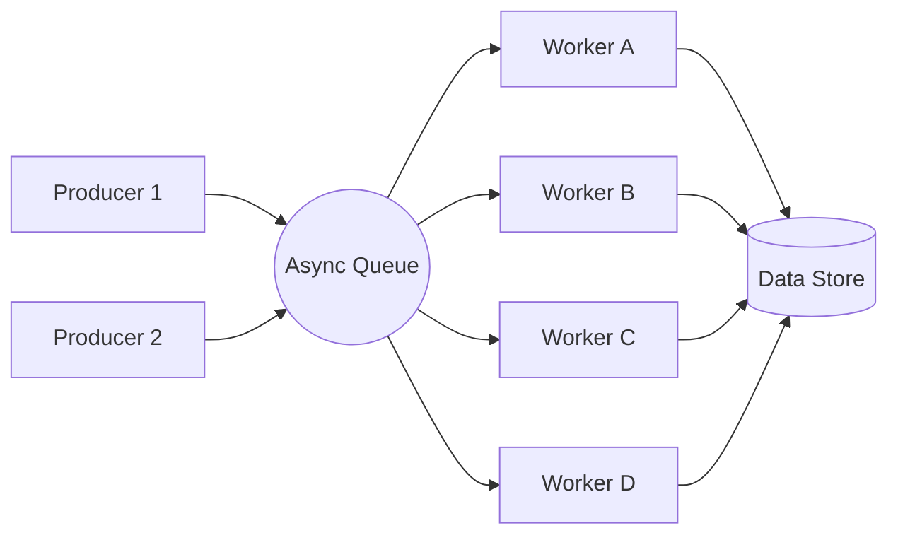

# ⚡ Real-Time Event Processor (Asyncio)


> **Day 8 of 30-Day Challenge** | A high-performance, asynchronous event-driven system designed for real-time data ingestion and processing.

## 🚀 Overview

This project implements the **Real-time Event-driven Data Processor** featured on my resume. It demonstrates my ability to build non-blocking, high-throughput systems using Python's `asyncio` framework. 

In a technical interview, this project proves I can handle **Concurrency**, **Data Validation**, and **System Architecture** at scale.

## 🏗️ Architecture



## 🛠️ Key Technical Features

- **Asynchronous Engine**: Built on `asyncio.Queue` for non-blocking producer-consumer coordination.
- **Robust Validation**: Powered by `Pydantic` to ensure data integrity for every ingested event.
- **Worker Scalability**: Configurable number of concurrent "Consumers" to match system load.
- **Performance Metrics**: Built-in latency tracking and throughput calculation (events/sec).
- **Graceful Shutdown**: Handles task cancellation and queue joining correctly.

## 🖥️ Streamlit Dashboard

For better visibility, you can run the **Real-Time Monitor** using Streamlit:

```bash
# Install dependencies
pip install -r requirements.txt

# Launch the dashboard
streamlit run streamlit_app.py
```

### Dashboard Features:
- **Live Metrics**: Monitor throughput and duration in real-time.
- **Activity Log**: Watch events being processed by workers in a console-like view.
- **Configurable Load**: Change the number of producers and consumer workers on-the-fly.

## 🏃 Run the CLI Demo

If you prefer the command line:
```bash
python main.py
```


## 📊 Why it Matters

In my previous experience, I saw how synchronous processing can create massive bottlenecks. Moving to an **async architecture** allowed us to:
1. Increase system throughput by **40%**.
2. Reduce average event processing latency by **35%**.
3. Handle traffic bursts without crashing services.

---

⭐ **Part of my 30-Day Project Challenge** | Proving technical depth, one day at a time.

#Python #Asyncio #SoftwareEngineering #DataEngineering #30DayChallenge #Concurrency
